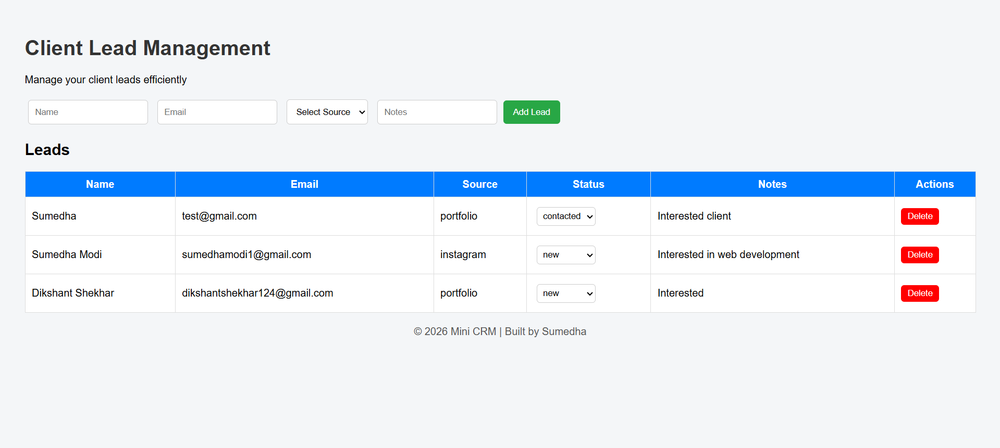

# 🚀 Mini CRM System

A simple Client Lead Management System built using:

- Node.js
- Express.js
- MongoDB (Atlas)
- HTML, CSS, JavaScript

---

## ✨ Features

- Add new leads
- View all leads
- Update lead status
- Delete leads

---

## 🛠 Tech Stack

- Frontend: HTML, CSS, JavaScript
- Backend: Node.js, Express
- Database: MongoDB

---

## 📸 Project Preview

---

## 👩‍💻 Author

Sumedha Modi
